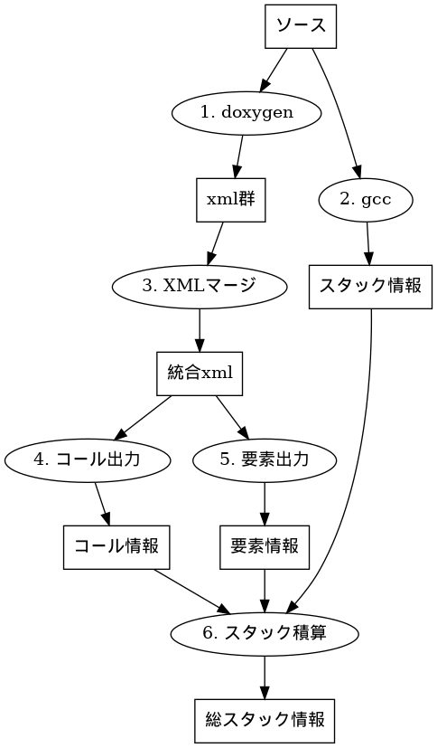

# code_analysis

コードの静的解析用ツール一式

## stack_usage.py

ある関数以下の総スタック量を集計します。
gccの`-fstack-usage`出力、doxygenによるコード解析結果を利用します。

### dependencies

- gcc (>=4.6)
- Doxygen
- Python (>=3.6)

### 実行の流れ



#### 1. doxygen

Doxygenを使い、ソースコードを解析します。xmlファイルを生成します。
解析方法は、Qiita記事[DoxygenでXMLファイル出力（依存関係等の解析結果含む）](https://qiita.com/tenmyo/items/5d799758afa3c487e7b9)を参考にしてください。

簡単な解析設定＆実行の例を以下に示します。

```sh
doxygen -g - | sed \
  -e '/^OPTIMIZE_OUTPUT_FOR_C/s/NO/YES/' \
  -e '/^EXTRACT/s/ NO/ YES/' \
  -e '/^INPUT /s/=$/=src/' \
  -e '/^REFFERENCE/s/ NO/ YES/' \
  -e '/^GENERATE_/s/ YES/ NO/' \
  -e '/^GENERATE_XML/s/ NO/ YES/' \
  -e '/^CLASS_DIAGRAMS/s/ YES/ NO/' \
  > Doxyfile.dxy
doxygen Doxyfile.dxy
```

#### 2. gcc

gccで`-fstack-usage`オプションをつけてコンパイルします。すると、`.su`ファイルが生成されます。
makeやconfigure時に`CFLAGS`を設定すると、gccオプションが設定されることが多いでしょう。

`find -name '*.su' | xargs cat > stack_usage.txt`のようにして、１ファイルにまとめると扱いやすくなります。

#### 3. XMLマージ

Doxygenで出力されたXMLファイル群を、扱いやすくするため１つにまとめます。

- linux: `xsltproc -o combined.xml xml/combine.xslt xml/index.xml`
- windows: `doxygenxml_combine.bat`にXMLフォルダをドラッグ＆ドロップ

#### 4. コール出力

Doxygen出力を解析し、どの関数からどの関数を読んでいるか、出力します。

- linux: `xsltproc -o ref.tsv ref_dump.xslt combined.xml`
- windows: `ref_dump.bat`に、1つにまとまったXMLをドラッグ＆ドロップ

#### 5. 要素出力

Doxygen出力を解析し、どんな関数があるか、出力します。

- linux: `xsltproc -o member.tsv member_dump.xslt combined.xml`
- windows: `member_dump.bat`に、1つにまとまったXMLをドラッグ＆ドロップ

#### 6. スタック積算

ここまでの出力から、スタックを積算します。

`stack_usage.py 要素情報ファイル コール情報ファイル スタック情報ファイル
        対象関数名 [対象関数のあるファイル]`
